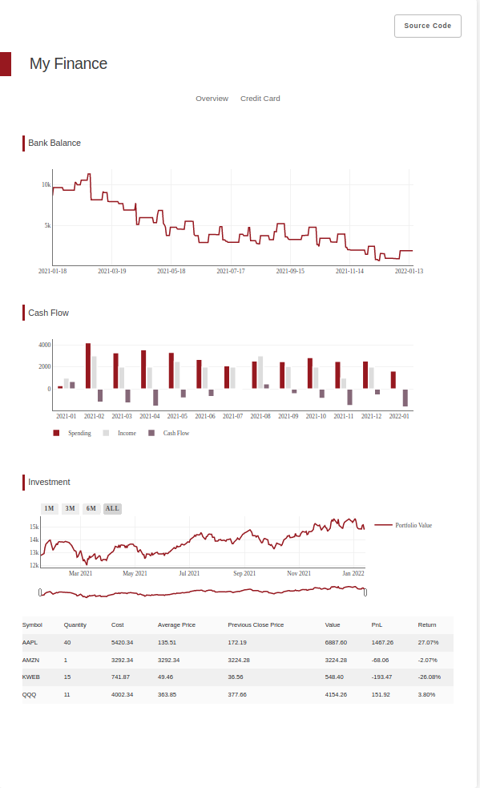
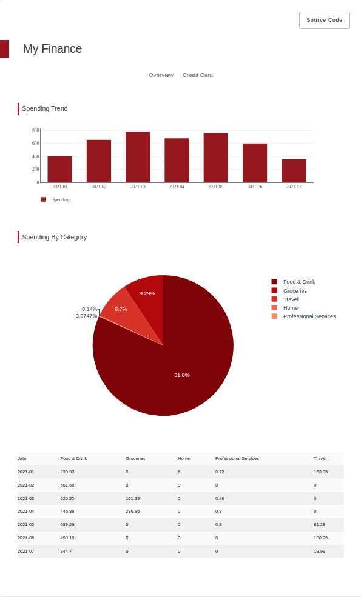

# PyMint
Automate personal finances without data collection.

## Usage
1. Download `csv` statements from your bank accounts.
2. Edit `config.py` to load statements. Example configurations are included.
3.  Run to start the frontend.
    ```
    pip install -r requirements
    python app.py
    ```

## Preview 

